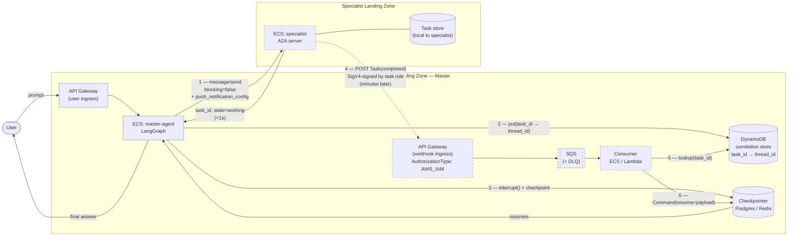
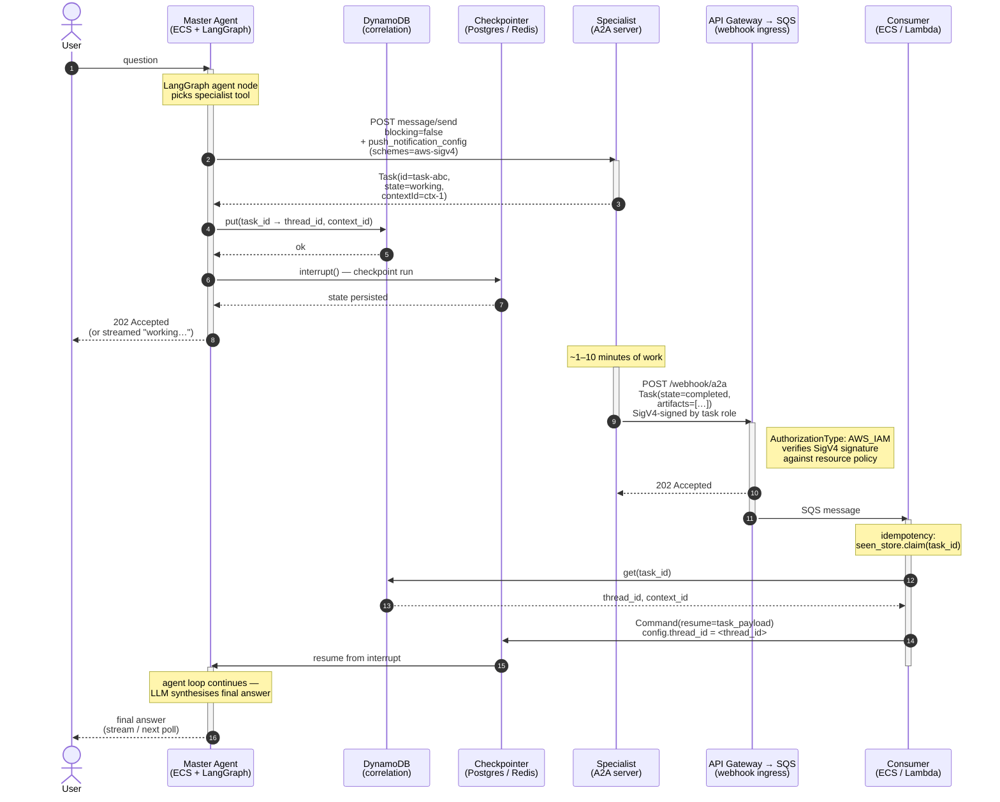

# Async Cross-Landing-Zone A2A Orchestration

> **Scope.** Design note for a Master Agent (LangGraph on ECS) that orchestrates
> long-running specialist agents (A2A servers) living in **different AWS landing
> zones**. Individual specialist calls can take **>90 seconds** — sometimes
> several minutes. The master must survive AWS idle timeouts, multi-instance
> ECS scaling, and network flakiness between landing zones, while still
> behaving like a normal conversational agent from the user's point of view.

---

## 1. Context and goals

- **Master Agent** — LangGraph `create_agent` graph, deployed as an ECS service
  in a *hub* landing zone. Fronted by an API Gateway for user traffic. Stores
  conversation state in a LangGraph checkpointer.
- **Specialist Agents** — A2A servers (A2A Protocol v0.3+), one per capability.
  Each specialist lives in its **own landing zone / VPC / account**. They
  already publish an `agent-card.json` at `/.well-known/agent-card.json`.
- **Transport** — A2A JSON-RPC over HTTPS between landing zones, allowed by
  the inter-LZ networking (TGW / PrivateLink / VPC peering + NACL/SG rules).
- **Master is onboarding many of these specialists** over time. The onboarding
  contract should be *"publish an A2A card + post back to a webhook when
  done"* — nothing more.

### Non-functional goals

| Goal | Target |
|---|---|
| Survive specialist responses taking 1–10 minutes | Master must **not** hold an HTTP connection while waiting |
| Master can scale horizontally on ECS | Any instance can resume any conversation — **no sticky sessions** |
| Clean onboarding for new specialists | They implement A2A and publish a URL. No master-side code changes. |
| Resilience to dropped inter-LZ connections | The protocol must be resumable by `task_id` |
| Observability | Every hop carries `task_id` + `context_id`; ideally OpenTelemetry `trace_id` too |

---

## 2. Why synchronous blocking fails in this environment

A naïve "master makes an HTTP call, waits for the answer" pattern breaks here
because AWS has several idle-timeout layers that will silently kill long
requests:

| Layer | Default idle timeout | Configurable? |
|---|---|---|
| ALB / NLB | **60s** | Up to 4000s, but network-wide |
| API Gateway REST | **29s hard max** | No |
| API Gateway HTTP | **30s** default / **29s max** for integration response | No |
| NAT Gateway | **350s** | No |
| Client `httpx` default | 5s | Yes |
| Cross-account TGW routes | Arbitrary | Depends |

Any of these firing mid-call leaves the master with a dead connection, no
result, and no way to recover the work the specialist already did. We need
the connection to be **short-lived** so none of these timeouts matter.

---

## 3. Chosen pattern — A2A push-notification with LangGraph interrupt/resume

Two independent flows:

**Fast path (sync, short connection):** master → specialist with
`message/send` + `blocking: false` + a `PushNotificationConfig`. Specialist
returns `Task(id=..., state=working)` in <1s. Connection closes.

**Slow path (async, fire-and-forget):** specialist finishes work minutes
later and POSTs the completed `Task` to the master's webhook URL. Webhook
lands in SQS (durable, retryable). A consumer reads from SQS, looks up the
correlation between `task_id` and the LangGraph `thread_id`, and resumes the
graph.

In between, the master's LangGraph run is **interrupted** — its state is
checkpointed to Postgres/Redis and the ECS task is free to serve other
traffic. No connections held, no threads blocked, no timeouts to worry
about.

---

## 4. Architecture



**Legend.** Solid arrows are synchronous, short-lived HTTPS calls. Dashed
arrows are the delayed push-notification path — they may fire seconds or
minutes after step 1.

**Key property.** Every arrow between landing zones is a **short-lived**
HTTPS request — either the fast `message/send` (step 1) or the delayed
push notification (step 4). Nothing holds a connection open across AWS
idle timeouts.

---

## 5. End-to-end sequence



**Reading notes.**
- Steps 1–6 are all short-lived synchronous HTTPS calls; total wall-clock is
  typically under a second. After step 6 the master has nothing in memory —
  the ECS task is free to serve other traffic.
- The "minutes of work" gap is the only long-running segment, and it
  happens **entirely inside the specialist** with no inbound connections
  held on the master side.
- Steps 7–13 are all short-lived, so the exact ECS task instance that
  handles the webhook does **not** need to be the same one that originally
  called the specialist — the shared checkpointer is what makes that work.

---

## 6. Component design

### 6.1 Master Agent — outbound call (LangGraph tool)

Conceptual shape of the tool — replaces the current synchronous
`RemoteA2AAgent.ask()`:

```python
from langgraph.types import interrupt
from a2a.types import (
    Message, Part, TextPart, Role,
    MessageSendConfiguration, PushNotificationConfig,
    PushNotificationAuthenticationInfo,
)

async def ask_async(
    client,                     # a2a.client.Client
    question: str,
    *,
    thread_id: str,
    correlation_store,
    webhook_arn: str,           # arn:aws:execute-api:<region>:<acct>:<api>/<stage>/POST/webhook/a2a
    webhook_url: str,           # invoke URL matching the ARN above
) -> str:
    message = Message(
        message_id=str(uuid.uuid4()),
        role=Role.user,
        parts=[Part(root=TextPart(text=question))],
    )
    config = MessageSendConfiguration(
        blocking=False,                       # do NOT wait for completion
        accepted_output_modes=["text/plain"],
        push_notification_config=PushNotificationConfig(
            url=webhook_url,
            authentication=PushNotificationAuthenticationInfo(
                # SigV4 + IAM. Specialist signs the POST with its own task
                # role; master's API Gateway authorizer (AWS_IAM) validates.
                schemes=["aws-sigv4"],
                credentials=webhook_arn,
            ),
        ),
    )

    # 1. short-lived RPC — returns immediately with task_id
    task = await _send_nonblocking(client, message, config)

    # 2. register correlation BEFORE returning, so a fast specialist can't
    #    race the webhook past us
    await correlation_store.put(
        task_id=task.id,
        thread_id=thread_id,
        context_id=task.context_id,
    )

    # 3. suspend this run; LangGraph will checkpoint state
    result = interrupt({"task_id": task.id, "state": "working"})

    # when the webhook consumer resumes us with Command(resume=<payload>),
    # `result` receives that payload
    return _extract_text(result)
```

### 6.2 Correlation store

Purpose: map `task_id` → (`thread_id`, `context_id`, metadata) so the webhook
consumer can resume the right LangGraph run.

**Recommended:** DynamoDB with a TTL of 24–48h. Simple, serverless, scales
horizontally, cross-AZ replication free.

| Attribute | Type | Notes |
|---|---|---|
| `task_id` (PK) | string | From specialist |
| `thread_id` | string | LangGraph thread id |
| `context_id` | string | A2A context id, for follow-ups |
| `assistant_id` | string | Which graph to resume |
| `created_at` | number | UNIX seconds |
| `status` | string | `pending` / `completed` / `failed` |
| `ttl` | number | epoch seconds for auto-eviction |

A `GSI` on `thread_id` lets you list in-flight tasks per conversation (useful
for cancellation + debugging).

### 6.3 Webhook ingress — API Gateway → SQS

Make the webhook endpoint **API Gateway → SQS directly** (HTTP API with an
`AWS_PROXY` integration to SQS `SendMessage`). Zero code in the hot path.

- Accepts POST `/webhook/a2a`.
- `AuthorizationType: AWS_IAM` on the route — API Gateway natively validates
  the caller's SigV4 signature and rejects unauthorised principals. No
  custom authorizer Lambda needed.
- A resource policy on the API grants `execute-api:Invoke` on this route to
  each registered specialist's task role ARN.
- On success, enqueues the raw body into SQS and returns `202 Accepted`.

Why not direct Lambda? Because SQS gives you:
- Automatic retries with exponential backoff
- DLQ on poison messages
- Backpressure when downstream (ECS consumer) is overloaded
- Durability if the consumer is down during deploy

### 6.4 Webhook consumer (ECS sidecar or Lambda)

```python
async def handle_webhook(sqs_message: dict) -> None:
    payload = json.loads(sqs_message["body"])      # TaskPushNotificationEvent
    task = payload["result"]                         # a2a Task dict
    task_id = task["id"]

    # idempotency — webhook may be delivered multiple times
    if await seen_store.claim(task_id):
        return

    entry = await correlation_store.get(task_id)
    if entry is None:
        # Race: the specialist beat the master's registration. Put on the
        # retry queue (short visibility timeout) up to N times.
        raise RetryLater("correlation not yet written")

    # Resume the suspended LangGraph run with the specialist's answer
    from langgraph.types import Command
    from master_agent.agent import graph      # the same compiled graph

    await graph.ainvoke(
        Command(resume=_task_to_resume_payload(task)),
        config={"configurable": {"thread_id": entry.thread_id}},
    )

    await correlation_store.mark_completed(task_id)
```

### 6.5 Specialist agent — push-notification emitter

This is **already in the A2A spec** — most SDKs implement it. On the
specialist side you don't change the agent logic, only the server config:

- Accept `push_notification_config` on incoming `message/send`.
- Persist it alongside the task (SQLite, Redis, wherever tasks live).
- On task completion / failure, POST the final `Task` to the saved URL with
  the saved auth credentials.
- Retry with exponential backoff on 5xx (3–5 attempts is typical).

For the Python `a2a-sdk`, this is handled by the
`PushNotificationSender` / `PushNotifier` classes in the task manager.
Concretely: when you build the server, register a `PushNotifier` and the
default task store will call it on every status update that matches the
caller's `push_notification_config`.

---

## 7. LangGraph interrupt/resume — the glue that makes it feel synchronous

LangGraph's `interrupt()` is literally designed for this: it marks a suspension
point in a graph, persists state via the checkpointer, and returns control.
The graph can be resumed later with `Command(resume=<value>)`, which is then
returned from the original `interrupt()` call as if no time had passed.

**Why this fits our problem perfectly:**
- The ECS task that made the outbound call can exit and be terminated —
  state lives in the checkpointer, not in memory.
- Any ECS task (different instance, different AZ) can resume the same
  conversation because checkpointer state is shared.
- The tool appears synchronous to the agent loop — from the LLM's
  perspective it just called `ask()` and got an answer back, even though
  hours might have passed.

**Shared checkpointer is mandatory for multi-instance ECS:**
- Local SQLite checkpointer (what this POC uses today) is **single-instance
  only**. Fine for dev.
- For production on ECS, switch to `AsyncPostgresSaver` against RDS, or
  Redis via `langgraph-checkpoint-redis`. Any instance can then resume any
  thread.

---

## 8. Security

### 8.1 Webhook authentication

**Preferred: AWS SigV4 + IAM** (both ends are in AWS — use the platform).

- Master's API Gateway webhook route has `AuthorizationType: AWS_IAM`.
- A resource policy on the webhook route grants `execute-api:Invoke` to each
  specialist's ECS/Lambda **task role** (by role ARN, or by account ID +
  path prefix for many specialists).
- Specialist's outbound HTTP call is signed with SigV4 using its own task
  role's credentials — `botocore.auth.SigV4Auth` + `botocore.awsrequest.AWSRequest`
  does this in ~10 lines.
- API Gateway validates the signature; the caller ARN lands in
  `requestContext.identity.userArn` for audit.
- Zero shared secrets, zero key rotation, cross-account done via IAM trust,
  replay protection built into SigV4's timestamp window (±15 min).

Map this to A2A by setting:

```python
PushNotificationAuthenticationInfo(
    schemes=["aws-sigv4"],
    credentials="arn:aws:execute-api:<region>:<master-acct>:<api-id>/<stage>/POST/webhook/a2a",
)
```

Specialist-side signing sketch (runs inside the specialist's
`PushNotifier` just before the POST):

```python
import boto3
from botocore.auth import SigV4Auth
from botocore.awsrequest import AWSRequest

session = boto3.Session()                             # picks up task role
creds = session.get_credentials().get_frozen_credentials()
req = AWSRequest(method="POST", url=webhook_url, data=json.dumps(body),
                 headers={"Content-Type": "application/json"})
SigV4Auth(creds, "execute-api", session.region_name).add_auth(req)

await httpx_client.post(webhook_url, content=req.body, headers=dict(req.headers))
```

Master-side: nothing to write. `AWS_IAM` authorizer is native to API Gateway.

**Fallbacks for non-AWS specialists** (future-proofing the onboarding contract):
- **Bearer JWT** — master issues a short-lived signed token per request with
  `task_id` as a claim; specialist presents it back in `Authorization`. Use
  this when a specialist lives outside AWS.
- **HMAC over body** — shared-secret alternative; avoids JWT expiry bookkeeping.
- **mTLS** — regulated environments; operationally heavier.

Pick SigV4 as the default. Keep one fallback wired up so a non-AWS
specialist can still onboard — the specialist just declares which scheme it
will use in its agent card, the master chooses accordingly when constructing
`PushNotificationAuthenticationInfo`.

### 8.2 Idempotency

Webhooks retry. Track "seen task_ids" in a separate DynamoDB table (or a
Redis set) with the same TTL. First writer wins; duplicates are dropped.

### 8.3 Replay protection

Include a `nonce` claim in the JWT and reject duplicates. Alternatively
require `task_id` to be in `pending` state — once you resume the graph and
flip it to `completed`, a replay is a no-op.

### 8.4 Outbound allow-listing

Each landing zone's egress/ingress should pin the peer's SG/VPC endpoint —
don't let the webhook URL be fetched from the specialist's response
uncritically. The master should know the list of registered specialist URLs
up front.

---

## 9. Operational concerns

### 9.1 Checkpointer

| Env | Suggestion |
|---|---|
| Local dev | `AsyncSqliteSaver` (what we have today) |
| POC on a single ECS task | Same, mounted on EFS — works but slow |
| Production | `AsyncPostgresSaver` on RDS, or Redis |

### 9.2 Cancellation

If the user abandons a request, the master should call A2A `tasks/cancel` on
the specialist. Keep a `cancel` endpoint on the master that looks up
`thread_id → task_id`s and fires cancels.

### 9.3 Timeouts for the async path

Even async flows need a **deadline**. Put a TTL on the correlation entry
(e.g. 30 min). A sweeper Lambda finds expired entries and resumes the graph
with a synthetic failure payload (`{"state":"failed","error":"timeout"}`)
so the master can tell the user "the specialist didn't respond in time"
rather than hanging forever.

### 9.4 Observability

Three IDs to propagate through logs, metrics, and traces:
- `thread_id` (LangGraph conversation)
- `context_id` (A2A conversation)
- `task_id` (A2A task instance)

Add a structured log line at every hop: `master.send`, `master.interrupt`,
`webhook.received`, `sqs.enqueued`, `consumer.resume`, `graph.completed`.
OpenTelemetry's `traceparent` header propagates automatically via
`HTTPXClientInstrumentor` on the master side; add
`FastAPIInstrumentor.instrument_app(app)` on both sides to keep the trace
continuous.

### 9.5 Scaling knobs

- ECS `master-agent` task count → depends on concurrent user conversations,
  not on specialist load.
- SQS visibility timeout for the webhook queue → ~5× expected consumer
  runtime; the consumer itself is a millisecond operation (just a
  `graph.ainvoke(Command(resume=...))`), so 30s is plenty.
- Consumer concurrency (Lambda reserved / ECS task count) → driven by
  webhook arrival rate, not by specialist duration.

---

## 10. Gotchas checklist

- [ ] **Registration race.** `correlation_store.put()` **must** complete
      before the master returns from the outbound `message/send`, otherwise
      a fast specialist can post the completion webhook before the master
      has recorded `task_id → thread_id`.
- [ ] **Idempotency.** The specialist will retry the webhook on 5xx. Dedup
      by `task_id` before resuming the graph — resuming twice usually
      produces a confusing double-answer to the user.
- [ ] **Out-of-order status updates.** If the specialist pushes both a
      `working` interim and a `completed` final, you may see them out of
      order across SQS shards. Only act on terminal states (`completed`,
      `failed`, `canceled`, `input_required`).
- [ ] **Cold-start webhook URL.** The webhook URL must be reachable the
      instant the specialist decides to POST. Keep the ingress warm — API
      Gateway + SQS doesn't cold-start, which is another reason to prefer
      it over a direct Lambda webhook.
- [ ] **Multi-instance checkpointer.** SQLite does not work across ECS
      tasks. Postgres or Redis.
- [ ] **LangGraph version pin.** `interrupt()` + `Command(resume=...)`
      semantics have evolved; pin the LangGraph version you test against.
- [ ] **Deadlines and cancellation.** Every task should have a
      server-side deadline, or you'll accumulate zombie correlation
      entries forever.
- [ ] **Auth credentials in logs.** Scrub `Authorization` headers and
      `PushNotificationAuthenticationInfo.credentials` from logs.
- [ ] **Payload size.** A2A Task artifacts can be large. API Gateway has
      a 10 MB request limit; SQS has a 256 KB message limit. For large
      artifacts, have the specialist drop the artifact into S3 and pass an
      S3 URL in the push-notification body.

---

## 11. POC milestones

| Milestone | Deliverable | Validates |
|---|---|---|
| **M1** | `RemoteA2AAgent.ask_async()` — non-blocking `message/send`, no webhook yet, master just polls `tasks/get` every 5s until done | A2A non-blocking path works cross-LZ; no idle-timeout issues |
| **M2** | DynamoDB correlation store + webhook ingress (API Gateway → SQS) on master, `PushNotifier` on specialist | End-to-end push path: specialist POSTs, master receives, no graph yet |
| **M3** | LangGraph `interrupt()` in the tool + webhook consumer calls `Command(resume=...)` | Suspended graph can be resumed from another ECS task |
| **M4** | Switch checkpointer from SQLite → Postgres; run 2+ master ECS tasks behind an ALB | Any instance can resume any conversation |
| **M5** | Auth (SigV4 + IAM on webhook route + specialist task-role signing), idempotency (seen-store), deadlines (sweeper) | Production-ready semantics |
| **M6** | OpenTelemetry traceparent propagation both sides | Single distributed trace end-to-end |

Each milestone is independently demo-able and builds strictly on the last.

---

## 12. Decisions to make before building

- **Correlation store:** DynamoDB (recommended) vs. Redis (lower latency,
  more infra).
- **Checkpointer:** Postgres (RDS) vs. Redis. Postgres is easier to inspect
  and debug; Redis is faster.
- **Webhook auth:** default to SigV4 + IAM for AWS-hosted specialists; pick
  one fallback scheme (Bearer JWT or HMAC) for any non-AWS specialist that
  onboards later.
- **Cancellation UX:** Does the user get a "cancel" button? If yes, you
  need `tasks/cancel` plumbing from day one.
- **Partial progress:** If specialists emit intermediate `working` updates
  with useful content (e.g. "step 2/5 done"), do you surface them to the
  user? If yes, the master's graph needs to accept multiple resumes per
  interrupt (streaming-style).

---

## 13. References

- [A2A Protocol Spec — Task lifecycle](https://a2a-protocol.org/latest/specification/#task-lifecycle)
- [A2A Protocol Spec — Push notifications](https://a2a-protocol.org/latest/specification/#push-notifications)
- [A2A Python SDK — `ClientFactory`, `ClientConfig`, `MessageSendConfiguration`](https://a2a-protocol.org/latest/sdk/python/)
- [LangGraph — Persistence & checkpointers](https://docs.langchain.com/oss/python/langgraph/persistence)
- [LangGraph — `interrupt()` and `Command(resume=...)`](https://docs.langchain.com/oss/python/langgraph/add-human-in-the-loop)
- [AWS — API Gateway to SQS integration](https://docs.aws.amazon.com/apigateway/latest/developerguide/integrating-api-with-aws-services-sqs.html)
- [AWS — ALB idle timeout](https://docs.aws.amazon.com/elasticloadbalancing/latest/application/application-load-balancers.html#connection-idle-timeout)
